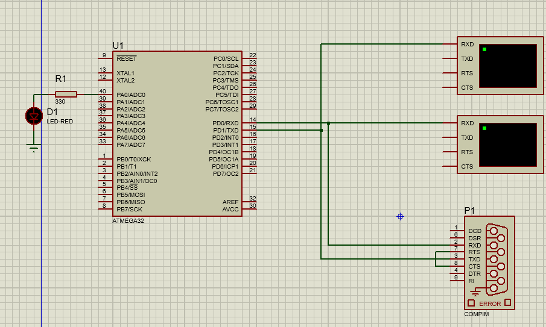
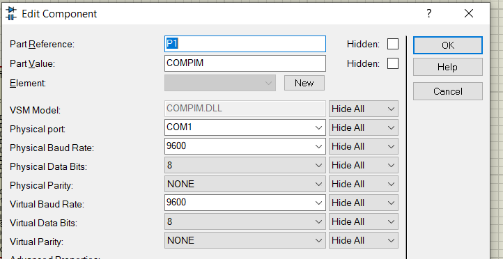
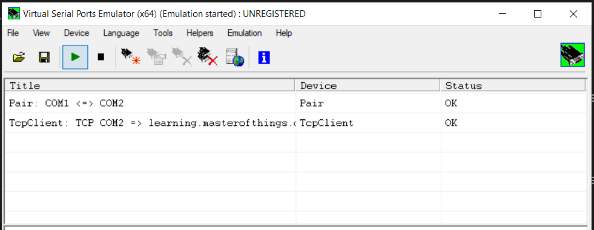
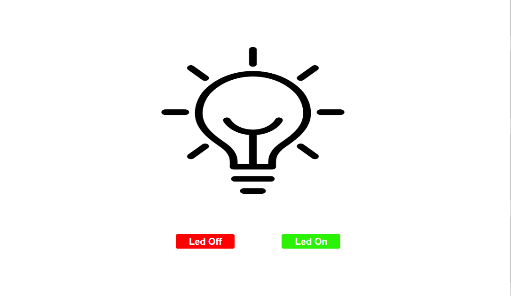
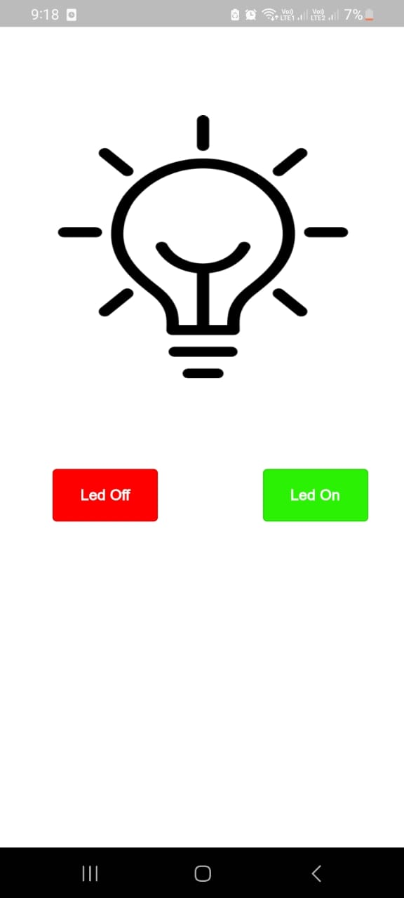

# LED Blink - IoT Project 

> This project demonstrates how to control an LED over the internet using both a web interface and a mobile app. The LED blink is simulated using Proteus, and the control is done through the Master of Things platform.

## Project Overview:
Goal: Remotely control an LED to blink on and off using a web page and mobile app.

## Project Steps
1- start with desgin circuit like that.

- virtual terminal to tracking MQTT packets
- Compin to send and recive data from Com1 

2- virtual Serial Port Emulator to connect Com2 to internet and connect Com1 with Com2 
        

3-develop sample web page to conrol led using Master of things plat form
        

also you could make mobile page using MOT  
        

**small video to run**

